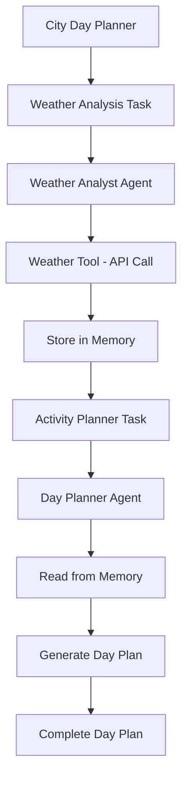

# City Day Planner with Mastra Agents

A weather-aware city day planner powered by Mastra agents and Trigger.dev. This system creates personalized day plans based on real-time weather conditions and detailed hourly forecasts.

## 🌟 Features

- **Weather-Aware Planning**: Creates activity recommendations based on current conditions and hourly forecasts
- **Intelligent Memory System**: Uses Mastra's working memory to efficiently share weather data between agents
- **Detailed Explanations**: Explains why each activity is recommended for specific weather conditions
- **Time-Specific Recommendations**: Separate plans for morning, afternoon, and evening
- **Backup Plans**: Indoor alternatives when weather turns bad
- **Gear Recommendations**: Suggests what to bring/wear based on conditions

## 🏗️ Architecture

### Agents

- **Weather Analyst** (`weather-analyst.ts`) - Collects and analyzes weather data, stores in memory
- **Day Planner** (`day-planner.ts`) - Reads weather data from memory and creates structured day plans

### Tasks

- **`weather-analysis`** - Analyzes weather and stores data in memory
- **`activity-planner`** - Creates day plan using weather data from memory
- **`city-day-planner`** - Orchestrates both tasks with shared memory

### Memory System

- **Shared Schema** (`weather-data.ts`) - Type-safe weather data structure
- **Working Memory** - Stores weather data between task executions
- **Thread-Scoped** - Data shared within same execution thread

## 🚀 Getting Started

### Prerequisites

- Node.js 18+
- OpenAI API key
- Trigger.dev account

### Installation

1. **Clone and install dependencies:**

```bash
git clone <repo-url>
cd mastra-agents
npm install
```

2. **Set up environment variables:**

```bash
cp .env.example .env
# Add your OpenAI API key to .env
OPENAI_API_KEY=your_openai_api_key_here
```

3. **Install Trigger.dev CLI:**

```bash
npm install -g @trigger.dev/cli@v4-beta
```

4. **Start the development server:**

```bash
npx trigger.dev@v4-beta dev
```

## 🎯 Usage

### Main Task: City Day Planner

Creates a complete weather-aware day plan:

```bash
npx trigger.dev@v4-beta dev --trigger city-day-planner --payload '{"location": "London"}'
```

**How it works:**

1. Weather analyst fetches detailed weather data and stores in memory
2. Day planner reads from memory and creates structured recommendations
3. No duplicate API calls - efficient memory-based task chaining

### Individual Tasks

**Weather Analysis Only:**

```bash
npx trigger.dev@v4-beta dev --trigger weather-analysis --payload '{"location": "Paris"}'
```

**Activity Planning Only:**

```bash
npx trigger.dev@v4-beta dev --trigger activity-planner --payload '{"location": "Tokyo"}'
```

### Sample Output

```json
{
  "success": true,
  "location": "London",
  "weatherAnalysis": "🌤️ Current conditions: 22°C, partly cloudy...",
  "dayPlan": "🌅 MORNING PLAN (6AM-12PM)\n• Hyde Park Walk - Perfect for cool morning temperatures (18°C)\n• Best timing: 7AM-10AM\n• Weather conditions: 18°C, 0% rain, light winds\n• Why it works: Cool temperatures ideal for walking...",
  "threadId": "run_abc123",
  "metadata": {
    "memoryShared": true,
    "totalProcessingTimeMs": 8432
  }
}
```

## 🧠 Memory System

The system uses Mastra's working memory to share weather data between agents:

```typescript
// Weather data stored in memory
{
  location: "London",
  lastUpdated: "2024-01-15T10:30:00Z",
  currentWeather: {
    temperature: 22,
    conditions: "Partly cloudy",
    // ... more current conditions
  },
  hourlyForecast: [
    {
      time: "2024-01-15T11:00:00Z",
      temperature: 23,
      precipitation: 0.1,
      // ... hourly details
    }
  ],
  dailyForecast: [
    // ... daily forecasts
  ]
}
```

## 🛠️ Technical Stack

- **Mastra**: Agent orchestration and memory management
- **Trigger.dev v4**: Task execution and monitoring
- **OpenAI GPT-4**: Natural language processing
- **Open-Meteo API**: Weather data (no API key required)
- **LibSQL**: Local database for memory storage
- **Zod**: Type-safe schema validation

## 📁 Project Structure

```
src/
├── mastra/
│   ├── agents/
│   │   ├── weather-analyst.ts    # Weather data collection
│   │   └── day-planner.ts        # Activity planning
│   ├── tools/
│   │   └── weather-tool.ts       # Enhanced weather API tool
│   ├── schemas/
│   │   └── weather-data.ts       # Shared weather schema
│   └── index.ts                  # Mastra configuration
├── trigger/
│   └── weather-task.ts           # Trigger.dev tasks
└── test-weather-agent.ts         # Local testing
```

## 🎨 Customization

### Adding New Agents

1. Create agent file in `src/mastra/agents/`
2. Add memory configuration if needed
3. Register in `src/mastra/index.ts`

### Modifying Weather Schema

Update `src/mastra/schemas/weather-data.ts` to change the weather data structure.

### Adding New Tasks

Create new tasks in `src/trigger/weather-task.ts` using the existing agents.

## 📊 Features Comparison

| Feature              | Before                 | After                  |
| -------------------- | ---------------------- | ---------------------- |
| Weather API Calls    | 2+ per execution       | 1 per execution        |
| Task Complexity      | Mixed responsibilities | Single responsibility  |
| Memory Usage         | No persistence         | Shared working memory  |
| Agent Specialization | Generic agents         | Specialized analysts   |
| Error Handling       | Basic logging          | Comprehensive tracking |

## 🔄 Task Flow



## 📈 Performance Benefits

- **50% fewer API calls** - Memory system eliminates duplicate weather requests
- **Faster execution** - No waiting for duplicate API responses
- **Better reliability** - Memory persistence across task failures
- **Cleaner architecture** - Specialized agents with clear responsibilities

## 🤝 Contributing

1. Fork the repository
2. Create a feature branch
3. Make your changes
4. Add tests if applicable
5. Submit a pull request

## 📄 License

MIT License - see LICENSE file for details

## 🙏 Acknowledgments

- [Mastra](https://mastra.ai) for the agent framework
- [Trigger.dev](https://trigger.dev) for task orchestration
- [Open-Meteo](https://open-meteo.com) for weather data
- [OpenAI](https://openai.com) for language models
