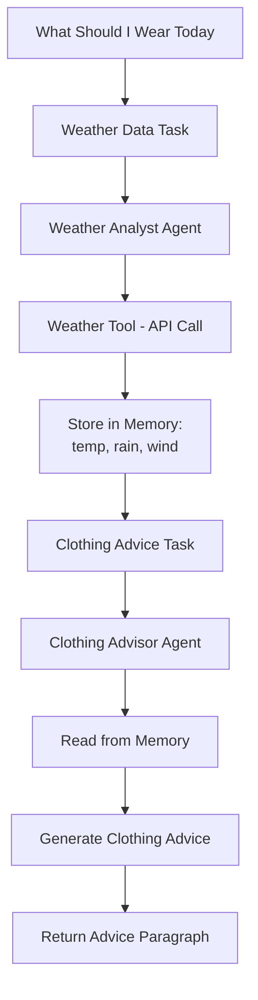

# What Should I Wear Today? - Mastra Agents

A weather-aware clothing advisor powered by Mastra agents and Trigger.dev. This system provides personalized clothing recommendations based on real-time weather conditions.

## 🌟 Features

- **Weather-Aware Clothing Advice**: Get clothing recommendations based on current temperature, rain chance, and wind speed
- **Intelligent Memory System**: Uses Mastra's working memory to efficiently share weather data between agents
- **Activity-Specific Recommendations**: Tailored advice for different activities (walking, running, etc.)
- **Fast Response**: Optimized for quick responses (~3 seconds)
- **Simple Input**: Just provide a city and optional activity
- **Natural Language Output**: Returns human-readable clothing advice paragraph

## 🏗️ Architecture

### Agents

- **Weather Analyst** (`weather-analyst.ts`) - Gets weather data and stores essentials in memory
- **Clothing Advisor** (`clothing-advisor.ts`) - Reads weather data from memory and provides clothing recommendations

### Tasks

- **`weather-data`** - Gets weather data and stores temperature, rain chance, and wind speed in memory
- **`clothing-advice`** - Reads weather data from memory and generates clothing recommendations
- **`what-should-i-wear-today`** - Main task that orchestrates both subtasks with shared memory

### Memory System

- **Simplified Schema** (`weather-data.ts`) - Lightweight weather data structure (4 fields only)
- **Working Memory** - Stores essential weather data between task executions
- **Thread-Scoped** - Data shared within same execution thread

## 🚀 Getting Started

### Prerequisites

- Node.js 18+
- OpenAI API key
- Trigger.dev account

### Installation

1. **Clone and install dependencies:**

```bash
git clone <repo-url>
cd mastra-agents
npm install
```

2. **Set up environment variables:**

```bash
cp .env.example .env
# Add your OpenAI API key to .env
OPENAI_API_KEY=your_openai_api_key_here
```

3. **Install Trigger.dev CLI:**

```bash
npm install -g @trigger.dev/cli@v4-beta
```

4. **Start the development server:**

```bash
npx trigger.dev@v4-beta dev
```

## 🎯 Usage

### Main Task: What Should I Wear Today?

Get clothing recommendations based on weather:

```bash
npx trigger.dev@latest dev --trigger what-should-i-wear-today --payload '{"city": "London", "activity": "walking"}'
```

**Payload:**

- `city` (required): City name (e.g., "London", "New York", "Tokyo")
- `activity` (optional): Activity type (defaults to "walking")

**How it works:**

1. Weather analyst fetches current weather data and stores temperature, rain chance, and wind speed in memory
2. Clothing advisor reads from memory and generates clothing recommendations
3. No duplicate API calls - efficient memory-based task chaining

### Individual Tasks

**Weather Data Only:**

```bash
npx trigger.dev@latest dev --trigger weather-data --payload '{"city": "Paris"}'
```

**Clothing Advice Only:**

```bash
npx trigger.dev@latest dev --trigger clothing-advice --payload '{"city": "Tokyo", "activity": "running", "threadId": "run_abc123"}'
```

### Sample Output

The main task returns a simple paragraph with clothing advice:

```
"For walking in London you should wear a light t-shirt or short-sleeved shirt with comfortable pants or shorts, as the temperature is warm at 25°C. With only a 3% chance of rain, you won't need any rain protection, and the light wind at 8 km/h means you can stick to breathable, comfortable clothing for your walk."
```

## 🧠 Memory System

The system uses Mastra's working memory to share simplified weather data between agents:

```typescript
// Weather data stored in memory
{
  location: "London",
  temperature: 24.8,      // Current temperature in Celsius
  rainChance: 3,          // Rain chance percentage (0-100)
  windSpeed: 8.3          // Wind speed in km/h
}
```

This simplified schema focuses on the essential data needed for clothing decisions, making the system faster and more efficient.

## 🛠️ Technical Stack

- **Mastra**: Agent orchestration and memory management
- **Trigger.dev v4**: Task execution and monitoring
- **OpenAI GPT-4**: Natural language processing
- **Open-Meteo API**: Weather data (no API key required)
- **LibSQL**: Local database for memory storage
- **Zod**: Type-safe schema validation

## 📁 Project Structure

```
src/
├── mastra/
│   ├── agents/
│   │   ├── weather-analyst.ts    # Weather data collection
│   │   ├── clothing-advisor.ts   # Clothing recommendations
│   │   └── day-planner.ts        # (Legacy) Activity planning
│   ├── tools/
│   │   └── weather-tool.ts       # Enhanced weather API tool
│   ├── schemas/
│   │   └── weather-data.ts       # Simplified weather schema
│   └── index.ts                  # Mastra configuration
├── trigger/
│   └── weather-task.ts           # Trigger.dev tasks
└── test-weather-agent.ts         # Local testing
```

## 🎨 Customization

### Adding New Agents

1. Create agent file in `src/mastra/agents/`
2. Add memory configuration if needed
3. Register in `src/mastra/index.ts`

### Modifying Weather Schema

Update `src/mastra/schemas/weather-data.ts` to change the weather data structure. The current schema is optimized for speed with just 4 fields.

### Adding New Activities

The system supports different activities. You can extend the clothing advisor agent to provide more specific recommendations for activities like:

- Running
- Cycling
- Hiking
- Formal events
- Outdoor work

### Adding New Tasks

Create new tasks in `src/trigger/weather-task.ts` using the existing agents.

## 📊 Features Comparison

| Feature              | Before (Day Planner)   | After (Clothing Advisor) |
| -------------------- | ---------------------- | ------------------------ |
| Weather API Calls    | 2+ per execution       | 1 per execution          |
| Data Schema          | 40+ fields complex     | 4 fields simplified      |
| Response Time        | 20+ seconds            | ~3 seconds               |
| Output Format        | Complex JSON structure | Simple text paragraph    |
| Memory Usage         | Full weather data      | Essential data only      |
| Agent Specialization | Generic agents         | Purpose-built agents     |

## 🔄 Task Flow



## 📈 Performance Benefits

- **Single API call** - Memory system eliminates duplicate weather requests
- **~3 second responses** - Optimized for speed with simplified data schema
- **Efficient memory usage** - Only 4 essential fields stored (vs 40+ in full schema)
- **Better reliability** - Memory persistence across task failures
- **Cleaner architecture** - Specialized agents with clear responsibilities

## 🤝 Contributing

1. Fork the repository
2. Create a feature branch
3. Make your changes
4. Add tests if applicable
5. Submit a pull request

## 📄 License

MIT License - see LICENSE file for details

## 🙏 Acknowledgments

- [Mastra](https://mastra.ai) for the agent framework
- [Trigger.dev](https://trigger.dev) for task orchestration
- [Open-Meteo](https://open-meteo.com) for weather data
- [OpenAI](https://openai.com) for language models
